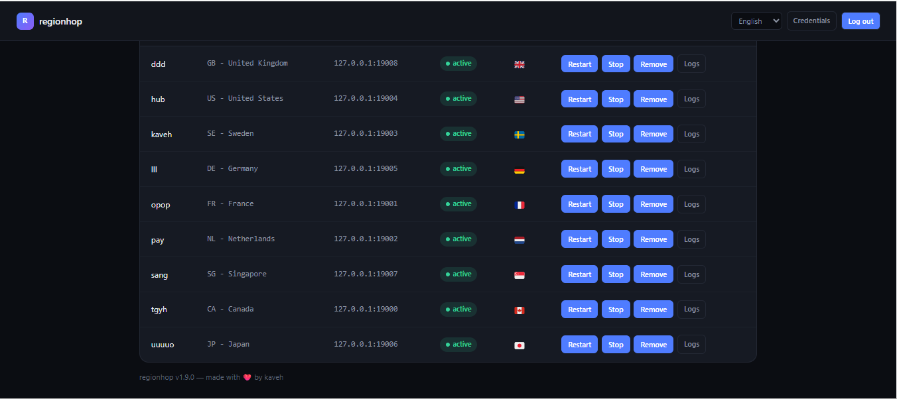

<div align="center">

**English · [Русский](README.ru.md) · [فارسی](README.fa.md) · [中文](README.zh.md)**

# regionhop

**Multi-region Psiphon tunnel manager for a single Linux server.**
Web panel + SSH CLI. SOCKS proxies stay local to the box — always.

[](LICENSE)
[](panel)
[-informational)](install.sh)
[](https://github.com/freeb5d/regionhop/releases/latest)



</div>

---

## Contents

- [What it does](#what-it-does)
- [Requirements](#requirements)
- [Install](#install)
- [Before you add a location](#before-you-add-a-location)
- [Using it](#using-it)
- [Exit region](#exit-region)
- [Managing it over SSH](#managing-it-over-ssh)
- [Updating](#updating)
- [How it's laid out](#how-its-laid-out)
- [Security model](#security-model)
- [Uninstall](#uninstall)
- [License](#license)

## What it does

regionhop runs several [`psiphon-tunnel-core`](https://github.com/psiphon-labs/psiphon-tunnel-core)
instances on one server, each configured to exit through a different Psiphon
region. Each instance exposes its own SOCKS5 proxy — bound to `127.0.0.1`
only, so it is **never reachable from outside the box**. A small Go web panel
lets you add, remove, start/stop, and watch logs for each region and see
which one is actually connected; the same actions are available over SSH via
a `psictl` command.

- ⚡ **No Go install, one download** — the installer fetches one prebuilt file with everything already compiled (on `amd64`/`arm64`/`armv7`); nothing is built on your server, which matters a lot on slow or restricted networks where downloading a whole toolchain and compiling from source is the step most likely to fail
- 🌍 **Multiple regions, one server** — spin up as many location tunnels as you want, each isolated in its own systemd unit
- 🔒 **Local-only by design** — SOCKS ports are bound to loopback in the Psiphon config *and* blocked at the firewall as a second layer; nothing in the panel can expose them externally
- 🖥 **Web panel** — bcrypt-hashed password, signed session cookies, login-attempt lockout, random listen port chosen at install time
- 📡 **Real connection status** — the dashboard shows *connecting* vs. *active* based on the tunnel's own notices, plus the exit region and flag once it lands
- ⌨️ **SSH-side control** — `psictl list|start|stop|restart|logs` for anyone who prefers the terminal
- ⚙️ **systemd-native** — every tunnel and the panel itself are ordinary systemd services: `systemctl status`, `journalctl`, auto-restart on failure, all work as expected
- 🔄 **Self-updating** — one command pulls the latest release and restarts the panel; the dashboard tells you when one's available
- 🌐 **Multi-language panel** — English, فارسی (Vazirmatn font, RTL), العربية (RTL), Русский, 中文; a switcher on every page, remembered per browser

## Requirements

- A Debian- or Ubuntu-based server with systemd, reachable over SSH as root (or a user who can `sudo`)
- `amd64`, `arm64`, or `armv7` for the fast path (one prebuilt bundle, no Go needed at all); any other architecture falls back to installing Go and building both the panel and the core from source automatically — everything else in the install works the same either way
- Your own Psiphon deployment config (see [Before you add a location](#before-you-add-a-location))

## Install

```bash
bash <(curl -Ls https://raw.githubusercontent.com/freeb5d/regionhop/master/install.sh)
```

This opens an interactive menu. For a first run, pick **1) Full setup** — it
detects your server's architecture and downloads a single bundle containing
both the panel and `psiphon-tunnel-core`'s `ConsoleClient` from the
[latest release](https://github.com/freeb5d/regionhop/releases/latest) (no Go
install needed on `amd64`/`arm64`/`armv7`; anything else falls back to
installing Go and building both from source), installs the systemd units,
adds a firewall rule blocking external access to the SOCKS port range, and
walks you through setting the panel's admin password. It prints the panel's
URL at the end — including a random path prefix (e.g.
`http://1.2.3.4:34521/a1b2c3d4e5f6/`), not just a random port. Save that
whole URL; the bare port with no path won't work, and (deliberately) won't
even tell a scanner anything is listening there — bare requests to the root
path get a generic 404, same as any other unknown path.

You can re-run the same command any time to reopen the menu (reinstall the
core + panel, rotate the password, check status, uninstall, etc.) — it's
idempotent.

> Both the panel and `ConsoleClient` (Psiphon's own tunnel core) ship
> together in one `regionhop-linux-<arch>.tar.gz` bundle per release, for
> `amd64`, `arm64`, and `armv7` — installing either is just one download on
> those architectures. Neither is rebuilt against a newer upstream source
> automatically — each regionhop release pins the `ConsoleClient` version it
> ships, and `psictl update` always installs that same pinned bundle rather
> than fetching
> Psiphon's latest source at install time.

## Before you add a location

Psiphon requires a config (`PropagationChannelId`, `SponsorId`, and usually
`RemoteServerListUrl`/signature public keys) issued to you by
[Psiphon Inc.](https://psiphon.ca) as a registered partner — regionhop has no
way to generate or fetch this, and doesn't ship any of it. Paste your own
config as a JSON object into the panel's **Psiphon config** page (or via the
installer's **Set Psiphon PropagationChannelId/SponsorId** menu option)
before adding your first location; every location added afterwards picks it
up automatically.

`EgressRegion`, `LocalSocksProxyPort`, `ListenInterface`, and
`DataRootDirectory` always come from regionhop itself and can't be
overridden by what you paste — that's what keeps every SOCKS proxy bound to
`127.0.0.1` no matter what your config contains.

## Using it

Open the panel URL printed at the end of setup, sign in, and:

1. **Psiphon config** (top-right) — paste your deployment config once
2. **Add location** — a name and a region; a SOCKS port is assigned automatically
3. Watch the status badge go **connecting** → **active**, and the Exit
   column fill in with the region Psiphon actually landed on
4. **Restart** / **Stop** / **Remove** / **Logs** per location, as needed

## Exit region

Once a location shows **active**, the dashboard's Exit column shows the
Psiphon server region it actually landed on, with a flag. This comes from
`psiphon-tunnel-core`'s own `ConnectedServerRegion` notice in the journal —
no outbound requests, no third-party service involved.

## Managing it over SSH

```bash
psictl list                 # show all location units
psictl start de-1           # enable + start a location
psictl stop de-1
psictl restart de-1
psictl logs de-1            # last 200 journal lines
psictl panel-restart
psictl panel-logs
psictl check-update          # compare installed vs. latest GitHub release
psictl update                # update the panel to the latest release, restart it
```

## Updating

The dashboard shows a banner (checked hourly, or on demand via the **Check
for updates** button at the bottom of the page) when a newer release is
published, with an **Update now** button right there — clicking it runs the
update in the background and restarts the panel automatically.

That button is deliberately the *only* thing the panel can trigger as root:
it runs one fixed, root-owned script via a NOPASSWD `sudoers` rule scoped to
that exact path (see [Security model](#security-model)) — not an open shell.
It runs the same flow as:

```bash
psictl update
```

or, without `psictl` installed:

```bash
bash <(curl -Ls https://raw.githubusercontent.com/freeb5d/regionhop/master/install.sh) update
```

Any of the three fetches the latest release, reinstalls both the core and
the panel (from the prebuilt bundle when available), reinstalls the systemd
units, and restarts the panel. Tunnels that were already running keep using
the old core binary until you restart them — from the panel's **Restart**
button or `psictl restart <name>` — since replacing the file on disk
doesn't affect an already-running process.

## How it's laid out

| Path | Purpose |
|---|---|
| `install.sh` | Interactive installer / menu, safe to re-run |
| `panel/` | Go web panel (auth, dashboard, settings) |
| `systemd/psi-tunnel@.service` | One systemd template, instantiated per region as `psi-tunnel@<name>` |
| `systemd/psi-panel.service` | The panel's own systemd unit |

On the server, everything lives under `/opt/psi-panel/`:

```
/opt/psi-panel/
├── core/ConsoleClient       # built Psiphon tunnel-core binary
├── configs/<name>.json      # one generated Psiphon config per location
├── data/<name>/             # per-location Psiphon data dir
├── data/tunnels.json        # panel's registry of locations
├── panel/psi-panel          # panel binary (downloaded or built)
├── panel/extra-config.json  # your pasted Psiphon deployment config
└── VERSION                  # currently installed regionhop version
```

## Security model

- Each location's `LocalSocksProxyPort` and `ListenInterface: "lo"` are
  applied *after* merging your pasted Psiphon config, so nothing you paste
  in can move a SOCKS port off loopback — that guarantee doesn't depend on
  the content of your config at all.
- A firewall rule additionally drops external traffic to the whole SOCKS
  port range (19000–19999) as defense-in-depth, independent of the config.
- The panel itself: bcrypt password hash, HMAC-signed session cookies,
  `HttpOnly`/`SameSite=Strict` cookies, and a 5-attempt login lockout per
  IP. Every tunnel-manipulating route requires an authenticated session.
- The panel process runs as an unprivileged `psipanel` system user. It has
  no standing root access. Everything it can do as root goes through one
  narrowly-scoped `sudoers` rule limited to exactly
  `systemctl {enable --now|disable --now|restart} psi-tunnel@*`,
  `systemctl restart psi-panel`, and executing one fixed, root-owned
  `self-update.sh` (no arguments, exact path) for the **Update now**
  button — nothing else on the box, and no open shell access, is reachable
  through it.
- Each location's own systemd service additionally runs with
  `NoNewPrivileges`, `ProtectSystem=strict`, and a scoped `ReadWritePaths`.

## Uninstall

Re-run the installer and choose **Uninstall everything** — it stops and
removes every unit, deletes `/opt/psi-panel`, and removes the `psictl`
helper, the sudoers rule, and the `psipanel` system user.

## License

[MIT](LICENSE)
